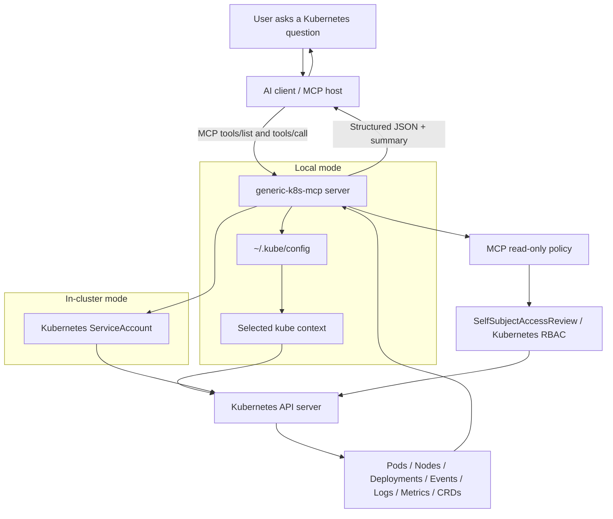

# Generic Kubernetes MCP Server

A read-only, context-aware Model Context Protocol (MCP) server for Kubernetes.

The goal is simple: let an AI assistant inspect Kubernetes clusters using the same access model as `kubectl` and K9s.

Project site and docs:

- GitHub Pages site source: [`docs/`](docs/)
- Gateway hosting plan: [`docs/gateway-plan.md`](docs/gateway-plan.md)

## Architecture



### Request flow

```text
Natural language
  -> AI client
  -> MCP tool call
  -> generic-k8s-mcp
  -> read-only policy check
  -> Kubernetes RBAC check
  -> Kubernetes API read
  -> structured result back to AI
```

## What this gives you

You can ask natural-language questions such as:

```text
Show unhealthy pods in namespace payments.
Why is deployment checkout-api not ready?
List nodes with pressure conditions.
Show warning events in kube-system.
Get the last 100 logs from pod api-123 in prod.
Can my current context list pods across all namespaces?
```

The server does **not** create its own admin access. It uses your existing kubeconfig context in local mode, or a Kubernetes ServiceAccount in in-cluster mode.

## Status

This is an MVP scaffold. It implements a minimal JSON-RPC/MCP stdio server in Go and exposes read-only Kubernetes tools.

## Design principles

1. **Use existing Kubernetes auth**: local mode uses kubeconfig/context; in-cluster mode uses the Pod ServiceAccount.
2. **RBAC is the source of truth**: every Kubernetes API call is checked with `SelfSubjectAccessReview` before running.
3. **Read-only by default**: no create, update, patch, delete, exec, port-forward, scale, apply, or secret reads by default.
4. **Generic Kubernetes first**: works with GKE, EKS, AKS, kubeadm, kind, minikube, and on-prem clusters.
5. **Cloud-specific integrations later**: GKE/EKS/AKS plugins can be added later without changing the core.

## Current tools

| Tool | Purpose |
|---|---|
| `cluster_info` | Show current access mode, context, namespace, and Kubernetes server version. |
| `can_i` | Check whether the current identity can perform a Kubernetes action. |
| `list_namespaces` | List visible namespaces. |
| `list_nodes` | List nodes, readiness, taints, capacity, and allocatable resources. |
| `describe_node` | Inspect a node's labels, taints, conditions, and resource info. |
| `list_pods` | List pods by namespace, label selector, and field selector. |
| `describe_pod` | Inspect pod phase, readiness, conditions, containers, warning events, and owning workload. |
| `get_pod_logs` | Read pod logs with optional container, tail, and since options. |
| `list_events` | List events in a namespace. |
| `list_deployments` | List deployment readiness and rollout status. |
| `describe_deployment` | Inspect one deployment. |
| `get_resource_usage` | Read pod or node usage from `metrics.k8s.io` when metrics-server is installed. |
| `find_unhealthy_workloads` | Summarize unhealthy pods/deployments and warning events. |
| `explain_resource` | Dynamically read any Kubernetes resource by apiVersion/kind/name. |

## Quick start: local mode

Use this first. Local mode is the simplest and safest because it uses the same kubeconfig/context access as `kubectl`.

### 1. Clone the repo

```bash
git clone https://github.com/vk7416/generic-k8s-mcp.git
cd generic-k8s-mcp
```

### 2. Install dependencies and build

```bash
go mod tidy
make build
```

This creates:

```text
bin/k8s-mcp-server
```

### 3. Confirm your Kubernetes context

```bash
kubectl config current-context
kubectl get ns
```

Optional but recommended:

```bash
kubectl auth can-i list pods -A
kubectl auth can-i get pods/log -n default
kubectl auth can-i list nodes
```

The MCP server will only be able to do what this context can do.

### 4. Run the MCP server manually

Use your current kubeconfig context:

```bash
./bin/k8s-mcp-server \
  --mode=local \
  --kubeconfig="$HOME/.kube/config" \
  --namespace=default \
  --readonly=true \
  --allow-secret-read=false \
  --allow-pod-command=false
```

Use a specific context:

```bash
./bin/k8s-mcp-server \
  --mode=local \
  --kubeconfig="$HOME/.kube/config" \
  --context=my-cluster-context \
  --namespace=kube-system \
  --readonly=true
```

## Connect it to an MCP client

The server currently uses stdio transport. Configure your MCP client to start the binary.

Example config:

```json
{
  "mcpServers": {
    "generic-k8s": {
      "command": "/absolute/path/to/generic-k8s-mcp/bin/k8s-mcp-server",
      "args": [
        "--mode=local",
        "--kubeconfig=/Users/YOU/.kube/config",
        "--context=YOUR_CONTEXT",
        "--namespace=default",
        "--readonly=true",
        "--allow-secret-read=false",
        "--allow-pod-command=false"
      ]
    }
  }
}
```

Replace:

```text
/absolute/path/to/generic-k8s-mcp/bin/k8s-mcp-server
/Users/YOU/.kube/config
YOUR_CONTEXT
```

with your real path and Kubernetes context.

## Manual JSON-RPC test

You can also test the server without an MCP client.

Start the server:

```bash
./bin/k8s-mcp-server --mode=local --namespace=default
```

Then send JSON-RPC messages from another shell using a simple pipe:

```bash
printf '%s\n' \
'{"jsonrpc":"2.0","id":1,"method":"initialize","params":{"protocolVersion":"2025-06-18","capabilities":{},"clientInfo":{"name":"manual","version":"dev"}}}' \
'{"jsonrpc":"2.0","id":2,"method":"tools/list","params":{}}' \
'{"jsonrpc":"2.0","id":3,"method":"tools/call","params":{"name":"cluster_info","arguments":{}}}' \
| ./bin/k8s-mcp-server --mode=local --namespace=default
```

List pods:

```bash
printf '%s\n' \
'{"jsonrpc":"2.0","id":1,"method":"initialize","params":{"protocolVersion":"2025-06-18","capabilities":{},"clientInfo":{"name":"manual","version":"dev"}}}' \
'{"jsonrpc":"2.0","id":2,"method":"tools/call","params":{"name":"list_pods","arguments":{"namespace":"default"}}}' \
| ./bin/k8s-mcp-server --mode=local --namespace=default
```

## In-cluster mode

In-cluster mode is useful later when you want the MCP server to run inside Kubernetes using a dedicated ServiceAccount.

Apply manifests:

```bash
kubectl apply -f deploy/namespace.yaml
kubectl apply -f deploy/rbac-readonly.yaml
kubectl apply -f deploy/deployment.yaml
```

In-cluster mode uses:

```text
system:serviceaccount:k8s-mcp:k8s-mcp-reader
```

Important: v1 is mainly a stdio MCP server. A production in-cluster deployment should add Streamable HTTP/SSE transport and strong auth before exposing it to users.

## Security defaults

The server blocks risky operations at the MCP policy layer and then asks Kubernetes RBAC before every read. This gives two layers of control:

```text
MCP readonly policy
  +
Kubernetes RBAC
```

By default, the server does **not** expose tools for:

- reading Secrets
- exec into Pods
- port-forward
- applying YAML
- patching resources
- deleting resources
- scaling or restarting workloads

## Repository layout

```text
cmd/k8s-mcp-server/      CLI entrypoint
internal/mcp/            Minimal MCP JSON-RPC server
internal/kube/           Kubernetes client/context loading
internal/authz/          SelfSubjectAccessReview checks
internal/policy/         Read-only guardrails
internal/tools/          Kubernetes MCP tools
deploy/                  Kubernetes deployment manifests
examples/                MCP client examples
docs/                    Architecture and security notes
```

## Troubleshooting

### `failed to initialize Kubernetes clients`

Check kubeconfig and context:

```bash
kubectl config current-context
kubectl get ns
```

Then run with an explicit kubeconfig:

```bash
./bin/k8s-mcp-server --mode=local --kubeconfig="$HOME/.kube/config"
```

### Access denied from a tool

Check RBAC:

```bash
kubectl auth can-i list pods -A
kubectl auth can-i get pods/log -n default
kubectl auth can-i list deployments.apps -n default
```

### Metrics tool fails

The cluster may not have `metrics-server` or a compatible `metrics.k8s.io` API installed.

Check:

```bash
kubectl top pods -A
kubectl top nodes
```

## MVP limitations

- The stdio transport is implemented directly with newline-delimited JSON-RPC.
- HTTP/SSE or Streamable HTTP transport can be added later.
- No write operations are implemented.
- Cloud provider integrations are intentionally out of scope for v1.

## License

Apache-2.0
