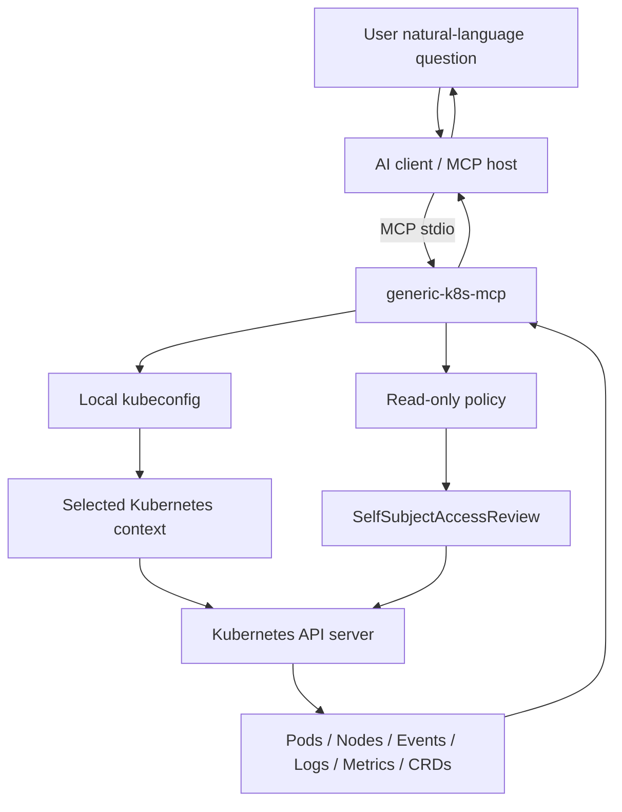

# Quickstart

This guide shows how to build and run `generic-k8s-mcp` locally using your existing Kubernetes context.

## Architecture



## 1. Clone

```bash
git clone https://github.com/vk7416/generic-k8s-mcp.git
cd generic-k8s-mcp
```

## 2. Build

```bash
go mod tidy
make build
```

Expected binary:

```text
bin/k8s-mcp-server
```

## 3. Check your current Kubernetes access

```bash
kubectl config current-context
kubectl get ns
kubectl auth can-i list pods -A
kubectl auth can-i get pods/log -n default
```

The MCP server uses the same access as this context.

## 4. Run locally

Current context:

```bash
./bin/k8s-mcp-server \
  --mode=local \
  --kubeconfig="$HOME/.kube/config" \
  --namespace=default \
  --readonly=true \
  --allow-secret-read=false \
  --allow-pod-command=false
```

Specific context:

```bash
./bin/k8s-mcp-server \
  --mode=local \
  --kubeconfig="$HOME/.kube/config" \
  --context=YOUR_CONTEXT \
  --namespace=default \
  --readonly=true
```

## 5. Configure your MCP client

Example stdio MCP config:

```json
{
  "mcpServers": {
    "generic-k8s": {
      "command": "/absolute/path/to/generic-k8s-mcp/bin/k8s-mcp-server",
      "args": [
        "--mode=local",
        "--kubeconfig=/Users/YOU/.kube/config",
        "--context=YOUR_CONTEXT",
        "--namespace=default",
        "--readonly=true",
        "--allow-secret-read=false",
        "--allow-pod-command=false"
      ]
    }
  }
}
```

## 6. Ask questions

Examples:

```text
Show unhealthy pods in namespace default.
Why is deployment api not ready?
Show warning events in kube-system.
List nodes with pressure conditions.
Can my current context list pods across all namespaces?
```

## 7. Manual test without an MCP client

```bash
printf '%s\n' \
'{"jsonrpc":"2.0","id":1,"method":"initialize","params":{"protocolVersion":"2025-06-18","capabilities":{},"clientInfo":{"name":"manual","version":"dev"}}}' \
'{"jsonrpc":"2.0","id":2,"method":"tools/list","params":{}}' \
'{"jsonrpc":"2.0","id":3,"method":"tools/call","params":{"name":"cluster_info","arguments":{}}}' \
| ./bin/k8s-mcp-server --mode=local --namespace=default
```

## Notes

- Local mode is recommended first.
- In-cluster mode is included but remote production usage needs HTTP/SSE or Streamable HTTP transport later.
- No write operations are implemented in v1.
